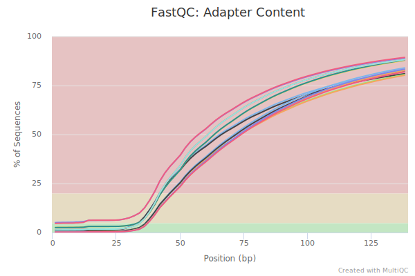
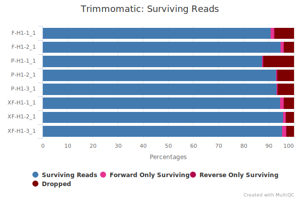
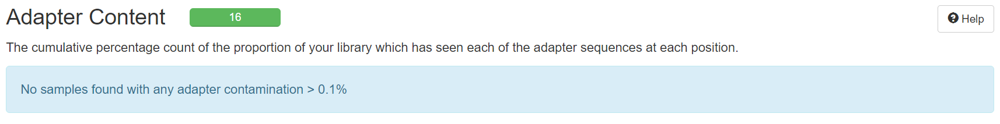
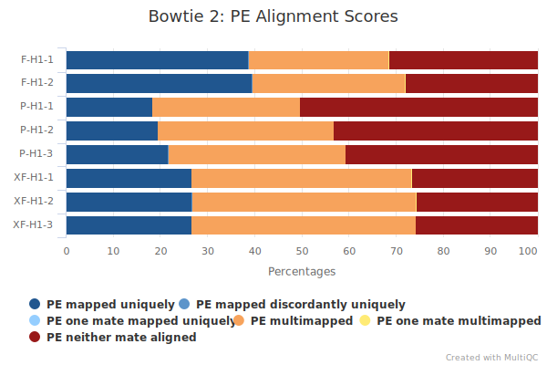
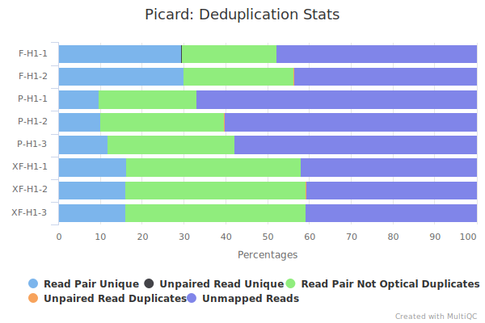
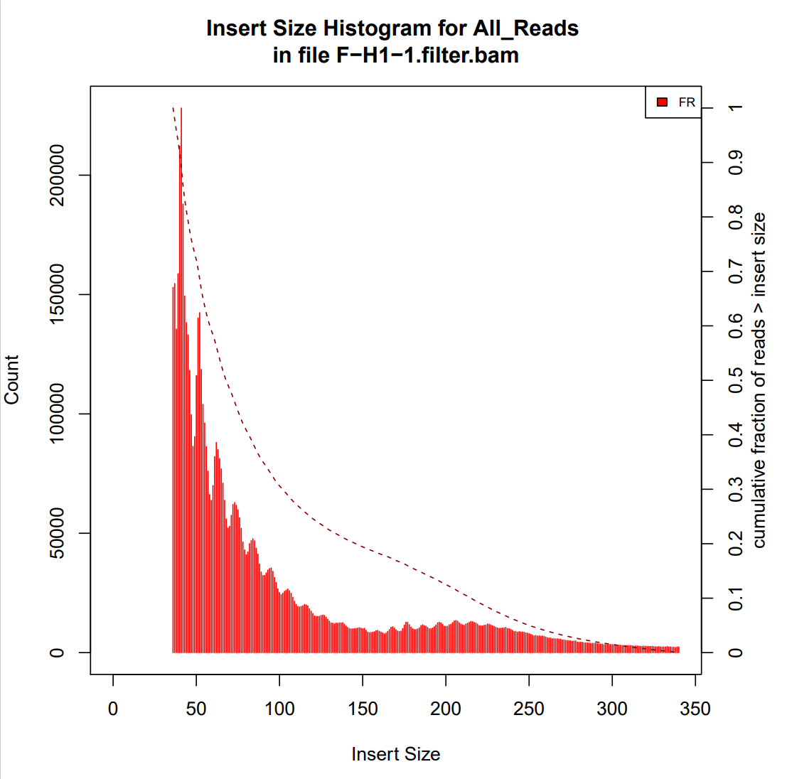

```{r setup, include = FALSE}
knitr::opts_chunk$set(
  collapse = F,
  comment = ""
)
```

```{css, echo = FALSE}
pre {
  max-height: 300px;
  overflow-y: auto;
  background-color: AliceBlue;
}

pre[class] {
  max-height: 200px;
}
```

## Setting

```{r}
settingList <- list(
  workDir = ".",
  fastqcDir = "fastqc",
  trimmomaticDir = "app/Trimmomatic-0.39/trimmomatic-0.39.jar",
  trimAdapter = "app/Trimmomatic-0.39/adapters/NexteraPE-PE.fa",
  bt2Dir = "bowtie2",
  mapRef = "fasta/genome",
  stDir = "samtools",
  picardDir = "app/picard.jar",
  bedtDir = "bedtools",
  macs2Dir = "macs2",
  dtDir = "",
  bdg2bwDir = "app/bedGraphToBigWig",
  refLen = "fasta/genome.fa.fai",
  idrDir = "idr",
  homerDir = "",
  knownMotif = "app/homer/data/knownTFs/vertebrates/known.motifs"
)
```

## Load packages

```{r, eval = FALSE}
setwd(settingList$workDir)

library(tidyverse)
library(magrittr)
library(glue)
```

## Rename files used

```{r, eval = FALSE}
# setwd("0_fastq")
# 
# list.files(".")
# 
# from_file <- list.files(".", "")
# to_file <- gsub("", "", from_file)
# 
# file.rename(from_file, to_file)
# 
# setwd("..")
```

## Load data

```{r}
file_name <- list.files("0_fastq", ".gz")

R1 <- grep("_1\\.", file_name, value = T)
R2 <- grep("_2\\.", file_name, value = T)

sample_name <- gsub("_1\\..*", "", R1)
sample_name
```

## QC for raw data

```{r, eval = FALSE}
dir.create("code")

qc_dir <- "1_qc"
qc_dir %>% dir.create()

qc <- settingList$fastqcDir

qc_cmd <- glue("{qc} -o {qc_dir} -t 8 0_fastq/{file_name} &")
cat(qc_cmd[1])

write.table(c("#!/bin/bash\n", qc_cmd), glue("code/{qc_dir}.sh"), quote = F, row.names = F, col.names = F)
```

```{bash}
cat code/1_qc.sh
```

After all fastqc tasks done, we can combine all the results using multiqc.

```{bash, eval = FALSE}
multiqc -o 1_qc -f -n qc.raw 1_qc/*.zip
```

We can open the .html report `1_qc/qc.raw.html` to check the QC metrics got by `fastqc`.
As we can see, there are some adapters remaining in these files.

{width="80%"}

So trimming is needed in most cases.

## Trim adapters

```{r, eval = FALSE}
dir.create("2_trim")
dir.create(".2_untrim")

trim <- settingList$trimmomaticDir
adapter <- settingList$trimAdapter

trim_cmd <- glue(
  "java -jar {trim} PE -threads 10 \\
  0_fastq/{R1} 0_fastq/{R2} \\
  2_trim/{sample_name}_1.trim.fastq.gz \\
  .2_untrim/{sample_name}_1.untrim.fastq.gz \\
  2_trim/{sample_name}_2.trim.fastq.gz \\
  .2_untrim/{sample_name}_2.untrim.fastq.gz \\
  ILLUMINACLIP:{adapter}:2:30:7:1:true \\
  LEADING:3 TRAILING:3 SLIDINGWINDOW:4:15 MINLEN:36 > 2_trim/{sample_name}.trim.log 2>&1")
cat(trim_cmd[1])

trim_dir <- "2_trim"
trim_dir %>% str_c("code/", .) %>% dir.create()

setCMD(trim_cmd, str_c("code/", trim_dir), 8, F)
```

Here [this function](#Function) is needed to dispatch multiple commands to some batched scripts.

```{bash}
ls code/2_trim
```

The `submit.sh` is used to run these batched scripts at the same time.
After all trimming tasks done, we can combine all the results using multiqc.

```{bash, eval = FALSE}
multiqc -o 2_trim -f -n trim 2_trim/*.log
```

{width="80%"}

Some reads are dropped after trimming.

## QC for trimmed data

```{r, eval = FALSE}
qc_dir <- "3_qc"
qc_dir %>% dir.create()

file_name <- list.files("2_trim", ".gz")
qc_cmd <- glue("{qc} -o {qc_dir} -t 8 {trim_dir}/{file_name} &")
cat(qc_cmd[1])

write.table(c("#!/bin/bash\n", qc_cmd), glue("code/{qc_dir}.sh"), quote = F, row.names = F, col.names = F)
```

```{bash}
cat code/3_qc.sh
```

After all fastqc tasks done, we can combine all the results using multiqc.

```{bash, eval = FALSE}
multiqc -o 3_qc -f -n qc.trim 3_qc/*.zip
```

{width="80%"}

## Map to reference genome

```{r, eval = FALSE}
bt2 <- settingList$bt2Dir
ref <- settingList$mapRef

map_dir <- "4_map"
map_dir %T>% dir.create() %>% str_c("code/", .) %>% dir.create()

map_cmd <- glue(
  "{bt2} -p 20 --very-sensitive -X 2000 -x {ref} \\
  -1 {trim_dir}/{R1} -2 {trim_dir}/{R2} \\
  -S {map_dir}/{sample_name}.sam > {map_dir}/{sample_name}.log 2>&1")
cat(map_cmd[1])

setCMD(map_cmd, str_c("code/", map_dir), 8, F)
```

After all mapping tasks done, we can combine all the results using multiqc.

```{bash, eval = FALSE}
multiqc -o 4_map -f -n map 4_map/*.log
```

{width="80%"}

The mapping rates of samples are not very high here.

## Sort with position

The output `.sam` files should be converted to `.bam` files sorted with position.

```{r, eval = FALSE}
st <- settingList$stDir

sort_dir <- "5_sort"
sort_dir %T>% dir.create() %>% str_c("code/", .) %>% dir.create()

sort_cmd <- glue(
  "{st} view -@ 10 -bS {map_dir}/{sample_name}.sam | \\
  {st} sort -@ 10 > {sort_dir}/{sample_name}.bam")
cat(sort_cmd[1])

setCMD(sort_cmd, str_c("code/", sort_dir), 8, F)
```

## Remove duplicated reads

```{r, eval = FALSE}
picard <- settingList$picardDir

dedup_dir <- "6_dedup"
dedup_dir %T>% dir.create() %>% str_c("code/", .) %>% dir.create()

dedup_cmd <- glue(
  "java -Xms2g -Xmx8g -XX:ParallelGCThreads=8 -jar {picard} MarkDuplicates \\
  I={sort_dir}/{sample_name}.bam \\
  O={dedup_dir}/{sample_name}.dedup.bam \\
  M={dedup_dir}/{sample_name}.dedup.txt \\
  REMOVE_DUPLICATES=true > {dedup_dir}/{sample_name}.dedup.log 2>&1")
cat(dedup_cmd[1])

setCMD(dedup_cmd, str_c("code/", dedup_dir), 8, F)
```

After all de-duplicating tasks done, we can combine all the results using multiqc.

```{bash, eval = FALSE}
multiqc -o 6_dedup -f -n dedup 6_dedup/*.txt
```

{width="80%"}

Many duplicated reads are removed.

## Filter low quality reads

The reads with low quality should be removed:

-   Reads not properly mapped

-   Reads with quality score < 30

-   Reads mapped to mitochondria or haplotype chromosomes

```{r, eval = FALSE}
fil_dir <- "7_filter"
fil_dir %>% dir.create()

filter_cmd <- glue(
  "{st} view -h -f 2 -q 30 {dedup_dir}/{sample_name}.dedup.bam | \\
  egrep -v '\\bMT|\\bGL|\\bJH' | {st} sort -@ 4 -O bam > {fil_dir}/{sample_name}.filter.bam &")
cat(filter_cmd[1])

write.table(c("#!/bin/bash\n", filter_cmd), glue("code/{fil_dir}.sh"), quote = F, row.names = F, col.names = F)
```

## Check length distribution of insert fragments

```{r, eval = FALSE}
picard <- settingList$picardDir

ins_dir <- "8_insert"
ins_dir %>% dir.create()

ins_cmd <- glue(
  "java -Xms2g -Xmx8g -XX:ParallelGCThreads=8 -jar {picard} CollectInsertSizeMetrics \\
  I={fil_dir}/{sample_name}.filter.bam \\
  O={ins_dir}/{sample_name}.txt \\
  H={ins_dir}/{sample_name}.pdf > {ins_dir}/{sample_name}.log 2>&1 &")
cat(ins_cmd[1])

write.table(c("#!/bin/bash\n", ins_cmd), glue("code/{ins_dir}.sh"), quote = F, row.names = F, col.names = F)

```

An example of the output files look like this.

{width="80%"}

## Shift reads for Tn5 occupation

```{r, eval = FALSE}
bedt <- settingList$bedtDir

shift_dir <- "9_shift"
shift_dir %>% dir.create()

shift_cmd <- glue(
  "{bedt} bamtobed -i {fil_dir}/{sample_name}.filter.bam | {awk_cmd} \\
  > {shift_dir}/{sample_name}.shift.bed &",
  awk_cmd = "awk -F '\\t' 'BEGIN {OFS = FS}{ if ($6 == \"+\") {$2 = $2 + 4} else if ($6 == \"-\") {$3 = $3 - 5} print $0}'")
cat(shift_cmd[1])

write.table(c("#!/bin/bash\n", shift_cmd), glue("code/{shift_dir}.sh"), quote = F, row.names = F, col.names = F)
```

## Call peak for each sample and each sample group

Here we use two peak calling strategies, for each sample and for each group of samples.

```{r, eval = FALSE}
macs2 <- settingList$macs2Dir

peak_dir <- "10_peak"
peak_dir %>% dir.create()

org <- "hs"
org <- "mm"

peak_cmd <- glue("
  {macs2} callpeak -t {shift_dir}/{sample_name}.shift.bed \\
  -g {org} --nomodel --shift -100 --extsize 200 --keep-dup all -n {sample_name} \\
  -B --outdir {peak_dir} > {peak_dir}/{sample_name}.log 2>&1 &")
cat(peak_cmd[1])

group_name <- tapply(sample_name, str_sub(sample_name, 1, -3), c)

group_peak_cmd <- glue(
  "{macs2} callpeak -t {peak_group} \\
  -g {org} --nomodel --shift -100 --extsize 200 --keep-dup all --SPMR -n group_{group} \\
  -B --outdir {peak_dir} > {peak_dir}/group_{group}.log 2>&1 &",
  peak_group = map_chr(group_name, ~ paste(glue("{shift_dir}/{.x}.shift.bed"), collapse = " ")),
  group = names(group_name))
cat(group_peak_cmd[1])

write.table(c("#!/bin/bash\n", peak_cmd), glue("code/{peak_dir}.sh"), quote = F, row.names = F, col.names = F)
write.table(c("#!/bin/bash\n", group_peak_cmd), glue("code/{peak_dir}_group.sh"), quote = F, row.names = F, col.names = F)
```

## Creat `.bigwig` files for track visualization

In convenient for visualization, we can creat `.bigwig` files for each sample or each sample group.
Besides, we can check the correlation coefficients among samples using these files.

```{r, eval = FALSE}
bw_dir <- "11_bw"
bw_dir %>% dir.create()

dt <- settingList$dtDir
bdg2bw <- settingList$bdg2bwDir
ref_len <- settingList$refLen

index_cmd <- glue("{st} index {fil_dir}/{sample_name}.filter.bam &")
cat(index_cmd[1])

bw_cmd <- glue("
  {dt}bamCoverage --normalizeUsing RPKM -of bigwig -b {fil_dir}/{sample_name}.filter.bam \\
  -o {bw_dir}/{sample_name}.bw &")
cat(bw_cmd[1])

group_bw_cmd <- glue(
  "{bdg2bw} {peak_dir}/group_{group}_treat_pileup.bdg {ref_len} {bw_dir}/{group}.bw &",
  group = names(group_name))
cat(group_bw_cmd[1])

sample_name <- list.files(bw_dir, "-[0-9].bw") %>% str_replace(".bw$", "")
group_name <- tapply(sample_name, str_sub(sample_name, 1, -3), c)

cor_cmd <- glue(
  "{dt}multiBigwigSummary bins -p 20 -b {bws} -o {bw_dir}/bw_cor.npz &",
  bws = str_c(glue("{bw_dir}/{sample_name}.bw"), collapse = " \\\n"))
cat(cor_cmd)

group_cor_cmd <- glue(
  "{dt}multiBigwigSummary bins -p 20 -b {group_bws} -o {bw_dir}/group_bw_cor.npz &",
  group_bws = str_c(glue("{bw_dir}/{names(group_name)}.bw"), collapse = " \\\n"))
cat(group_cor_cmd)

corplot_cmd <- glue(
  "{dt}plotCorrelation -in {bw_dir}/bw_cor.npz -c pearson -p heatmap --plotNumbers -o {bw_dir}/cor_heatmap.pdf --colorMap RdBu_r &")
cat(corplot_cmd)

group_corplot_cmd <- glue(
  "{dt}plotCorrelation -in {bw_dir}/group_bw_cor.npz -c pearson -p heatmap --plotNumbers -o {bw_dir}/group_cor_heatmap.pdf --colorMap RdBu_r &")
cat(group_corplot_cmd)

write.table(c("#!/bin/bash\n", index_cmd), glue("code/{bw_dir}_index.sh"), quote = F, row.names = F, col.names = F)
write.table(c("#!/bin/bash\n", bw_cmd), glue("code/{bw_dir}.sh"), quote = F, row.names = F, col.names = F)
write.table(c("#!/bin/bash\n", group_bw_cmd), glue("code/{bw_dir}_group.sh"), quote = F, row.names = F, col.names = F)

write.table(c("#!/bin/bash\n", cor_cmd), glue("code/{bw_dir}_cor.sh"), quote = F, row.names = F, col.names = F)
write.table(c("#!/bin/bash\n", group_cor_cmd), glue("code/{bw_dir}_cor_group.sh"), quote = F, row.names = F, col.names = F)
write.table(c("#!/bin/bash\n", corplot_cmd), glue("code/{bw_dir}_plot_cor.sh"), quote = F, row.names = F, col.names = F)
write.table(c("#!/bin/bash\n", group_corplot_cmd), glue("code/{bw_dir}_plot_cor_group.sh"), quote = F, row.names = F, col.names = F)
```

## Remove non-consensus peaks

For each sample, we may have multiple replicates. To get high quality peaks, we can use `idr` to keep only the peaks showed high consistency between replicate pairs.

```{r, eval = FALSE}
idr_dir <- "12_idr"
idr_dir %>% dir.create()

idr <- settingList$idrDir

idr_cmd <- map(group_name, ~ as_tibble(combn(.x, 2)) %>% map(~ paste(glue("{peak_dir}/{.x}_peaks.narrowPeak"), collapse = " "))) %>% 
  imap(~ glue("{idr} --samples {.x} --peak-list {peak_dir}/group_{.y}_peaks.narrowPeak \\
              --input-file-type narrowPeak --output-file {idr_dir}/{.y}")) %>% 
  map(~ imap(.x, ~ glue("{.x}-{.y}.idr.narrowPeak &"))) %>% unlist() %>% unname()
cat(idr_cmd[1])

write.table(c("#!/bin/bash\n", idr_cmd), glue("code/{idr_dir}.sh"), quote = F, row.names = F, col.names = F)

group_index <- map(group_name, ~ choose(length(.x), 2)) %>% imap(~ rep(.y, .x)) %>% unlist() %>% unname()
idr_file <- list.files(idr_dir, "idr", full.names = T)
idr_data <- map(idr_file, ~ read_delim(.x, "\t", col_names = F))
idr_peak <- map(idr_data, ~ .x[.x[[5]] > 540, ]) %>%
  map(~ str_c(.x[[1]], .x[[2]], .x[[3]], sep = "_")) %>%
  tapply(group_index, c) %>%
  map(~ unlist(.x) %>% unique)

group_file <- list.files(peak_dir, "^group.*Peak", full.names = T)
group_data <- map(group_file, ~ read.table(.x, sep = "\t", stringsAsFactors = F))
group_peak <- map(group_data, ~ str_c(.x[[1]], .x[[2]], .x[[3]], sep = "_"))

groupData <- pmap(list(idr_peak, group_peak, group_data), function(a, b, c) {c[b %in% a, ]})

iwalk(group_data, ~ write.table(.x, glue("{idr_dir}/{.y}.narrowPeak"), col.names = F, row.names = F, quote = F, sep = "\t"))
```

## Find enriched motifs of peaksets

```{r, eval = FALSE}
motif_dir <- "13_motif"
motif_dir %>% dir.create()
region_file <- list.files(motif_dir, "bed")

homer <- settingList$homerDir

org <- "hg19"
org <- "mm10"

motif_cmd <- glue(
  "{homer}findMotifsGenome.pl {motif_dir}/{region_file} {org} {motif_dir}/{rigion_name} \\
  -size 200 -len 8,10,12 > {region_file}/{region_name}.log 2>&1 &",
  region_name = str_replace(region_file, ".bed", ""))
cat(motif_cmd[1])

write.table(c("#!/bin/bash\n", motif_cmd), glue("code/{motif_dir}.sh"), quote = F, row.names = F, col.names = F)
```

## Get heatmap data for given regions

```{r, eval = FALSE}
heat_dir <- "14_heat"
heat_dir %>% dir.create()

sample_name <- list.files(bw_dir, "-[123].bw") %>% str_replace(".bw$", "")
group_name <- tapply(sample_name, str_sub(sample_name, 1, -3), c)

# for global
mat_cmd <- glue(
  "{dt}computeMatrix reference-point -a 2000 -b 2000 -p 20 -R {heat_dir}/hg19geneTSS.bed -S \\
  {bws} -o {heat_dir}/TSS_mtx.gz &",
  bws = str_c(glue("{bw_dir}/{names(group_name)}.bw"), collapse = " \\\n"))
cat(mat_cmd)

heat_cmd <- glue(
  "{dt}plotHeatmap -m {heat_dir}/TSS_mtx.gz --colorMap RdBu_r -o {heat_dir}/TSS_heatmap.pdf \\
  --outFileNameMatrix {heat_dir}/TSS_value.txt --outFileSortedRegions {heat_dir}/TSS_region.bed &")
cat(heat_cmd)

peak_group <- list.files(heat_dir, "peakGroup", full.names = T)

# for peaks
mat_cmd <- glue(
  "{dt}computeMatrix scale-regions -a 1000 -b 1000 -p 20 -R {peak} -S \\
  {bws} -o {heat_dir}/peak_mtx.gz &",
  peak = str_c(peak_group, collapse = " "),
  bws = str_c(glue("{bw_dir}/{names(group_name)}.bw"), collapse = " \\\n"))
cat(mat_cmd)

heat_cmd <- glue(
  "{dt}plotHeatmap -m {heat_dir}/peak_mtx.gz --colorMap RdBu_r -o {heat_dir}/peak_heatmap.pdf \\
  --outFileNameMatrix {heat_dir}/peak_value.txt --outFileSortedRegions {heat_dir}/peak_region.bed &")
cat(heat_cmd)

write.table(c("#!/bin/bash\n", mat_cmd), glue("code/{heat_dir}_mtx.sh"), quote = F, row.names = F, col.names = F)
write.table(c("#!/bin/bash\n", heat_cmd), glue("code/{heat_dir}.sh"), quote = F, row.names = F, col.names = F)
```

## Annotate peaks

```{r, eval = FALSE}
anno_dir <- "15_anno"
anno_dir %>% dir.create()

known_motif <- settingList$knownMotif

peak_file <- list.files(anno_dir, ".homer")

anno_cmd <- glue(
  "{homer}annotatePeaks.pl {anno_dir}/{peak_file} {org} -m {known_motif} -mscore > {anno_dir}/{peak_name}.txt &",
  peak_name = str_remove(peak_file, ".homer")
)
cat(anno_cmd)

write.table(c("#!/bin/bash\n", anno_cmd), glue("code/{anno_dir}.sh"), quote = F, row.names = F, col.names = F)
```

## Function {#Function}

This function is designed to dispatch multiple tasks to batched scripts.
By turning the option `clu` to `TRUE` we can create scripts used in high performance computer cluster.

```{r, eval = FALSE}
setCMD <- function(cmd, dir = ".", sepN = 1, clu = F) {
  cmd %>% tapply(seq_along(.) %% sepN, c) %>% imap(~ {
    ifelse(clu, glue(
      "#!/bin/bash
      #SBATCH -J batch{.y}
      #SBATCH -o batch{.y}.%j.out
      #SBATCH -e batch{.y}.%j.err
      #SBATCH -p cn-long
      #SBATCH -N 1
      #SBATCH --ntasks-per-node=20
      #SBATCH --no-requeue
      #SBATCH -A hkdeng_g1
      #SBATCH --qos=hkdengcnl
      export PATH=/gpfs1/hkdeng_pkuhpc/lvyl/app/anaconda3/envs/lvyl/bin:$PATH"),
      "#!/bin/bash") %>%
      c(.x)}) %T>%
    iwalk(~ write.table(.x, glue("{dir}/batch{.y}.sh"), quote = F, row.names = F, col.names = F)) %>%
    names() %>% map_chr(~ glue("{head} {dir}/batch{.x}.sh {tail}",
                               head = ifelse(clu, "pkubatch", "sh"),
                               tail = ifelse(clu, "; sleep 1", "&"))) %>%
    c("#!/bin/bash", .) %>% as_tibble() %>%
    write_delim(glue("{dir}/submit.sh"), "\n", col_names = F)
}
```

```{r}
sessionInfo()
```
