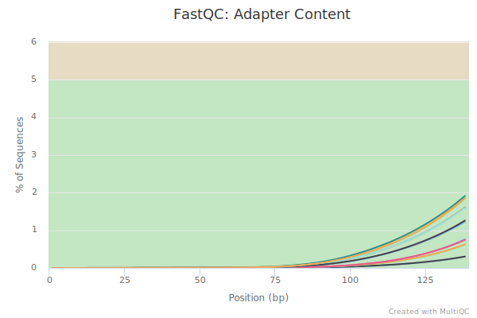
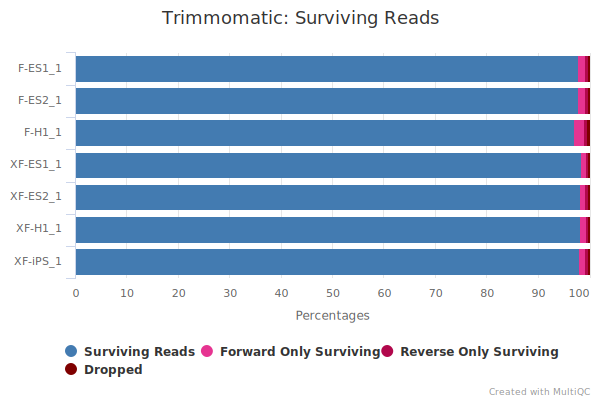
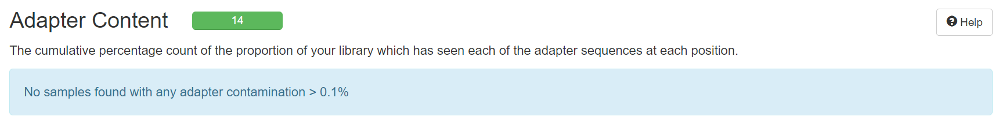
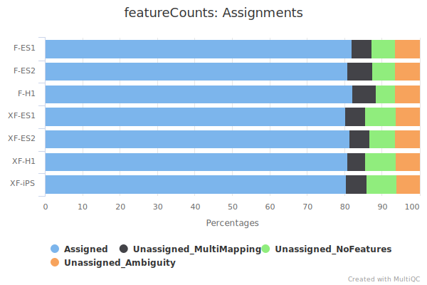

```{r setup, include = FALSE}
knitr::opts_chunk$set(
  collapse = F,
  comment = ""
)
```

```{css, echo = FALSE}
pre {
  max-height: 300px;
  overflow-y: auto;
  background-color: AliceBlue;
}

pre[class] {
  max-height: 200px;
}
```

## Setting

```{r}
settingList <- list(
  workDir = ".",
  fastqcDir = "fastqc",
  trimmomaticDir = "app/Trimmomatic-0.39/trimmomatic-0.39.jar",
  trimAdapter = "app/Trimmomatic-0.39/TruSeq3-PE-2.fa",
  starDir = "STAR",
  mapRef = "ref/hg19-STAR-cr3",
  inferDir = "app/anaconda3/envs/lvylenv/bin/infer_experiment.py",
  inferGene = "ref/hg19ensGene.clear.bed",
  countDir = "featureCounts",
  countAnno = "ref/genes.gtf"
)
```

## Load packages

```{r, eval = FALSE}
setwd(settingList$workDir)

library(tidyverse)
library(magrittr)
library(glue)
```

## Rename files used

```{r, eval = FALSE}
# setwd("0_fastq")
# 
# list.files(".")
# 
# from_file <- list.files(".", "")
# to_file <- gsub("", "", from_file)
# 
# file.rename(from_file, to_file)
# 
# setwd("..")
```

## Load data

```{r}
file_name <- list.files("0_fastq", ".gz")

R1 <- grep("_1\\.", file_name, value = T)
R2 <- grep("_2\\.", file_name, value = T)

sample_name <- gsub("_1\\..*", "", R1)
sample_name
```

## QC for raw data

```{r, eval = FALSE}
dir.create("code")

qc_dir <- "1_qc"
qc_dir %>% dir.create()

qc <- settingList$fastqcDir

qc_cmd <- glue("{qc} -o {qc_dir} -t 8 0_fastq/{file_name} &")
cat(qc_cmd[1])

write.table(c("#!/bin/bash\n", qc_cmd), glue("code/{qc_dir}.sh"), quote = F, row.names = F, col.names = F)
```

```{bash}
cat code/1_qc.sh
```

After all fastqc tasks done, we can combine all the results using multiqc.

```{bash, eval = FALSE}
multiqc -o 1_qc -f -n qc.raw 1_qc/*.zip
```

We can open the .html report `1_qc/qc.raw.html` to check the QC metrics got by `fastqc`.
As we can see, there are some adapters remaining in these files.

{width="80%"}

So trimming is needed in most cases.

## Trim adapters

```{r, eval = FALSE}
dir.create("2_trim")
dir.create(".2_untrim")

trim <- settingList$trimmomaticDir
adapter <- settingList$trimAdapter

trim_cmd <- glue(
  "java -jar {trim} PE -threads 10 \\
  0_fastq/{R1} 0_fastq/{R2} \\
  2_trim/{sample_name}_1.trim.fastq.gz \\
  .2_untrim/{sample_name}_1.untrim.fastq.gz \\
  2_trim/{sample_name}_2.trim.fastq.gz \\
  .2_untrim/{sample_name}_2.untrim.fastq.gz \\
  ILLUMINACLIP:{adapter}:2:30:7:1:true \\
  LEADING:3 TRAILING:3 SLIDINGWINDOW:4:15 MINLEN:36 > 2_trim/{sample_name}.trim.log 2>&1")
cat(trim_cmd[1])

trim_dir <- "2_trim"
trim_dir %>% str_c("code/", .) %>% dir.create()

setCMD(trim_cmd, str_c("code/", trim_dir), 7, F)
```

Here [this function](#Function) is needed to dispatch multiple commands to some batched scripts.

```{bash}
ls code/2_trim
```

The `submit.sh` is used to run these batched scripts at the same time.
After all trimming tasks done, we can combine all the results using multiqc.

```{bash, eval = FALSE}
multiqc -o 2_trim -f -n trim 2_trim/*.log
```

{width="80%"}

Very few reads are dropped after trimming, that's pretty good.

## QC for trimmed data

```{r, eval = FALSE}
qc_dir <- "3_qc"
qc_dir %>% dir.create()

file_name <- list.files("2_trim", ".gz")
qc_cmd <- glue("{qc} -o {qc_dir} -t 8 {trim_dir}/{file_name} &")
cat(qc_cmd[1])

write.table(c("#!/bin/bash\n", qc_cmd), glue("code/{qc_dir}.sh"), quote = F, row.names = F, col.names = F)
```

```{bash}
cat code/3_qc.sh
```

After all fastqc tasks done, we can combine all the results using multiqc.

```{bash, eval = FALSE}
multiqc -o 3_qc -f -n qc.trim 3_qc/*.zip
```

{width="80%"}

There is almost no adapters remaining after trimming, just as we expected.

## Map to reference genome

```{r, eval = FALSE}
star <- settingList$starDir
ref <- settingList$mapRef

map_dir <- "4_map"
map_dir %T>% dir.create() %>% str_c("code/", .) %>% dir.create()

map_cmd <- glue(
  "{star} --genomeDir {ref} \\
  --runThreadN 20 --outFileNamePrefix {map_dir}/{sample_name} \\
  --readFilesIn {trim_dir}/{R1} {trim_dir}/{R2} \\
  --readFilesCommand zcat --outSAMtype BAM Unsorted \\
  --outSAMstrandField intronMotif \\
  --outFilterIntronMotifs RemoveNoncanonical")
cat(map_cmd[1])

setCMD(map_cmd, str_c("code/", map_dir), 7, F)
```

After all mapping tasks done, we can combine all the results using multiqc.

```{bash, eval = FALSE}
multiqc -o 4_map -f -n map 4_map/*.out
```

{width="80%"}

The mapping rates of samples are very high.

## Infer experiment

Here we use [RSeQC](http://rseqc.sourceforge.net/#infer-experiment-py) to infer whether the RNA-seq sequencing are strand-specific.

```{r, eval = FALSE}
infer_path <- settingList$inferDir
gene_bed <- settingList$inferGene

infer_dir <- "5_infer"
infer_dir %>% dir.create()

infer_cmd <- glue("{infer_path} -r {gene_bed} -i {map_dir}/{sample_name}Aligned.out.bam > {infer_dir}/{sample_name}.infer.txt 2>&1 &")
cat(infer_cmd[1])

write.table(c("#!/bin/bash\n", infer_cmd), glue("code/{infer_dir}.sh"), quote = F, row.names = F, col.names = F)
```

```{bash}
cat 5_infer/*
```

We can see `Fraction of reads explained by "1++,1--,2+-,2-+"` and `Fraction of reads explained by "1+-,1-+,2++,2--"` are close, indicating these sequcing are non strand-specific.

## Count features

```{r, eval = FALSE}
count_path <- settingList$countDir
gtf <- settingList$countAnno

count_dir <- "6_count"
count_dir %>% dir.create()

count_cmd <- glue(
  "{count_path} -T 20 -g gene_id --extraAttributes gene_name -a {gtf} \\
  -o {count_dir}/counts.txt {samples}> {count_dir}/count.log 2>&1 &",
  samples = str_c(map_dir, "/", sample_name, "Aligned.out.bam \\\n", collapse = ""))
cat(count_cmd)

write.table(c("#!/bin/bash\n", count_cmd), glue("code/{count_dir}.sh"), quote = F, row.names = F, col.names = F)
```

After counting is done, we can combine all the results using multiqc.

```{bash, eval = FALSE}
multiqc -o 6_count -f -n count 6_count
```

{width="80%"}

The rates of assigned features are very high.

## Function {#Function}

This function is designed to dispatch multiple tasks to batched scripts.
By turning the option `clu` to `TRUE` we can create scripts used in high performance computer cluster.

```{r, eval = FALSE}
setCMD <- function(cmd, dir = ".", sepN = 1, clu = F) {
  cmd %>% tapply(seq_along(.) %% sepN, c) %>% imap(~ {
    ifelse(clu, glue(
      "#!/bin/bash
      #SBATCH -J batch{.y}
      #SBATCH -o batch{.y}.%j.out
      #SBATCH -e batch{.y}.%j.err
      #SBATCH -p cn-long
      #SBATCH -N 1
      #SBATCH --ntasks-per-node=20
      #SBATCH --no-requeue
      #SBATCH -A hkdeng_g1
      #SBATCH --qos=hkdengcnl
      export PATH=/gpfs1/hkdeng_pkuhpc/lvyl/app/anaconda3/envs/lvyl/bin:$PATH"),
      "#!/bin/bash") %>%
      c(.x)}) %T>%
    iwalk(~ write.table(.x, glue("{dir}/batch{.y}.sh"), quote = F, row.names = F, col.names = F)) %>%
    names() %>% map_chr(~ glue("{head} {dir}/batch{.x}.sh {tail}",
                               head = ifelse(clu, "pkubatch", "sh"),
                               tail = ifelse(clu, "; sleep 1", "&"))) %>%
    c("#!/bin/bash", .) %>% as_tibble() %>%
    write_delim(glue("{dir}/submit.sh"), "\n", col_names = F)
}
```

```{r}
sessionInfo()
```
