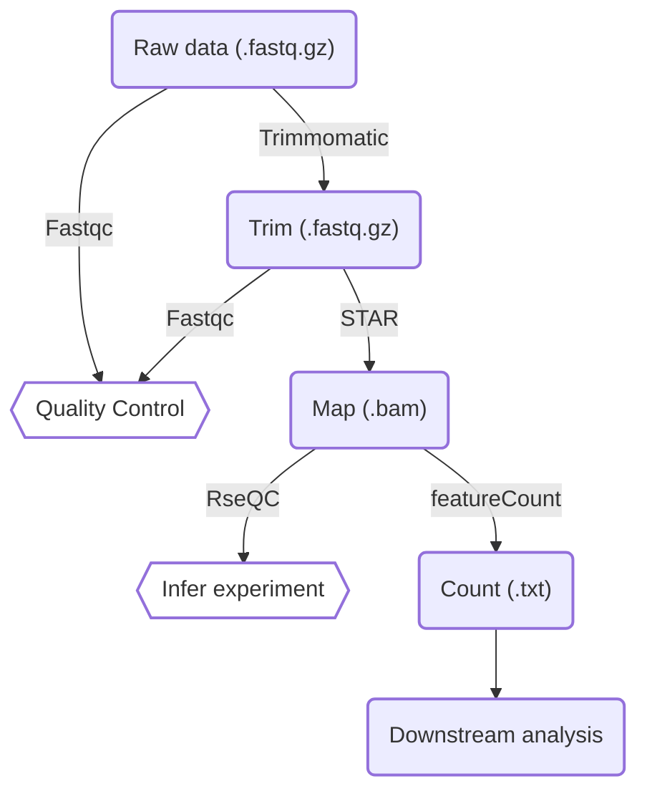
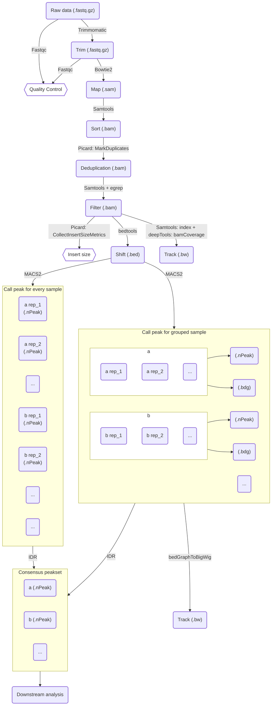
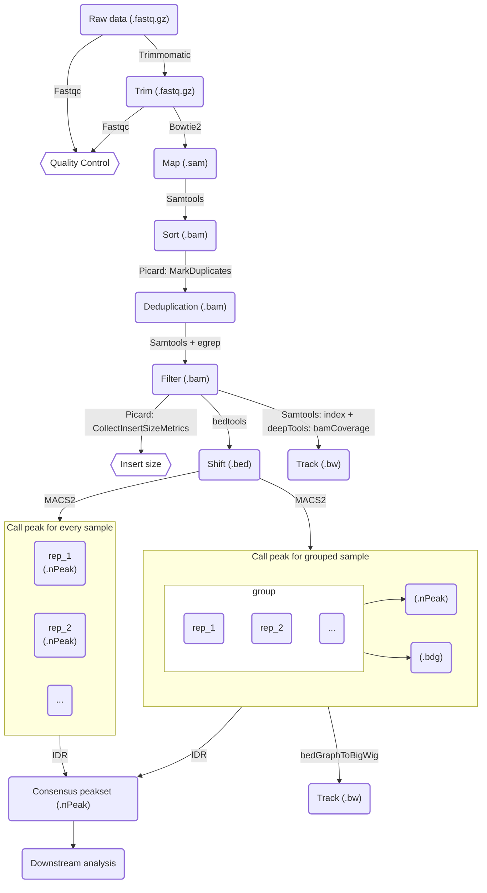
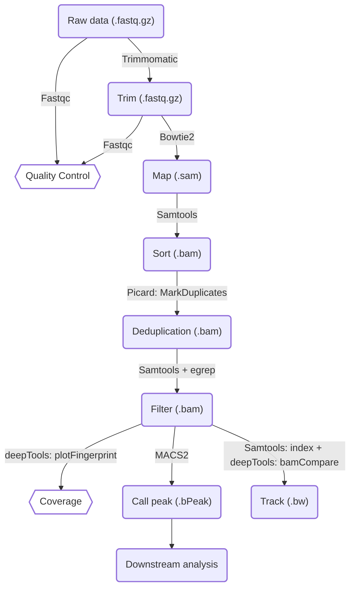
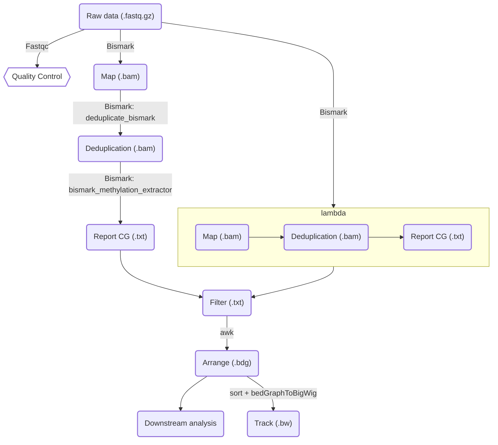

{
  "theme": "default",
  "themeVariables": {
    "fontSize": "18px",
    "edgeLabelBackground": "#ffffff"
  }
}

```mermaid
flowchart TD;
classDef default stroke-width: 2px ;
classDef qc fill: #ffffff ;
	A("Raw data (.fastq.gz)") -->|Fastqc| a{{"Quality Control"}}
	A -->|Trimmomatic| B("Trim (.fastq.gz)")
	B -->|Fastqc| a
	B -->|STAR| C("Map (.bam)")
	C -->|RseQC| c{{"Infer experiment"}}
	C -->|featureCount| D("Count (.txt)")
	D --> E("Downstream analysis")
class a,c qc
```

```mermaid
flowchart TD;
classDef default stroke-width: 2px ;
classDef qc fill: #ffffff ;
	A("Raw data (.fastq.gz)") -->|Fastqc| a{{"Quality Control"}}
	A -->|Trimmomatic| B("Trim (.fastq.gz)")
	B -->|Fastqc| a
	B -->|Bowtie2| C("Map (.sam)")
	C -->|Samtools| D("Sort (.bam)")
	D -->|Picard: MarkDuplicates| E("Deduplication (.bam)")
	E -->|Samtools + egrep| F("Filter (.bam)")
	F -->|Picard: CollectInsertSizeMetrics| f{{"Insert size"}}
	F -->|bedtools| G("Shift (.bed)")
	F -->|Samtools: index + deepTools: bamCoverage| J("Track (.bw)")
	subgraph H [Call peak for every sample]
	a1("a rep_1\n(.nPeak)")
	a2("a rep_2\n(.nPeak)")
	an("...")
	b1("b rep_1\n(.nPeak)")
	b2("b rep_2\n(.nPeak)")
	bn("...")
	nn("...")
	end
	subgraph I [Call peak for grouped sample]
		subgraph Ia [a]
		Ia_1("a rep_1")
		Ia_2("a rep_2")
		Ia_n("...")
		an("...")
		end
		Ia --> Ia_res1("(.nPeak)")
		Ia --> Ia_res2("(.bdg)")
		subgraph Ib [b]
		Ib_1("b rep_1")
		Ib_2("b rep_2")
		Ib_n("...")
		an("...")
		end
		Ib --> Ib_res1("(.nPeak)")
		Ib --> Ib_res2("(.bdg)")
		In("...")
	end
	G -->|MACS2| H
	G -->|MACS2| I
	subgraph K [Consensus peakset]
	Ka("a (.nPeak)")
	Kb("b (.nPeak)")
	Kn("...")
	end
	I -->|IDR| K
    H -->|IDR| K
	I -->|bedGraphToBigWig| L("Track (.bw)")
	K --> M("Downstream analysis")
class a,f,Ia,Ib qc
```

```mermaid
flowchart TD;
classDef default stroke-width: 2px ;
classDef qc fill: #ffffff ;
	A("Raw data (.fastq.gz)") -->|Fastqc| a{{"Quality Control"}}
	A -->|Trimmomatic| B("Trim (.fastq.gz)")
	B -->|Fastqc| a
	B -->|Bowtie2| C("Map (.sam)")
	C -->|Samtools| D("Sort (.bam)")
	D -->|Picard: MarkDuplicates| E("Deduplication (.bam)")
	E -->|Samtools + egrep| F("Filter (.bam)")
	F -->|Picard: CollectInsertSizeMetrics| f{{"Insert size"}}
	F -->|bedtools| G("Shift (.bed)")
	F -->|Samtools: index + deepTools: bamCoverage| J("Track (.bw)")
	subgraph H [Call peak for every sample]
	Ha_1("rep_1\n(.nPeak)")
	Ha_2("rep_2\n(.nPeak)")
	Ha_n("...")
	end
	subgraph I [Call peak for grouped sample]
		subgraph Ia [group]
		Ia_1("rep_1")
		Ia_2("rep_2")
		Ia_n("...")
		end
		Ia --> Ia_res1("(.nPeak)")
		Ia --> Ia_res2("(.bdg)")
		
	end
	G -->|MACS2| H
	G -->|MACS2| I
	I -->|IDR| K("Consensus peakset (.nPeak)")
    H -->|IDR| K
	I -->|bedGraphToBigWig| L("Track (.bw)")
	K --> M("Downstream analysis")
class a,f,Ia qc
```

```mermaid
flowchart TD;
classDef default stroke-width: 2px ;
classDef qc fill: #ffffff ;
	A("Raw data (.fastq.gz)") -->|Fastqc| a{{"Quality Control"}}
	A -->|Trimmomatic| B("Trim (.fastq.gz)")
	B -->|Fastqc| a
	B -->|Bowtie2| C("Map (.sam)")
	C -->|Samtools| D("Sort (.bam)")
	D -->|Picard: MarkDuplicates| E("Deduplication (.bam)")
	E -->|Samtools + egrep| F("Filter (.bam)")
	F -->|deepTools: plotFingerprint| f{{"Coverage"}}
	F -->|MACS2| G("Call peak (.bPeak)")
	F -->|Samtools: index + deepTools: bamCompare| H("Track (.bw)")
	G --> I("Downstream analysis") 
class a,f qc
```

```mermaid
flowchart TD;
classDef default stroke-width: 2px ;
classDef qc fill: #ffffff ;
	A("Raw data (.fastq.gz)") -->|Fastqc| a{{"Quality Control"}}
	A -->|Bismark| B("Map (.bam)")
	B -->|Bismark: deduplicate_bismark| C("Deduplication (.bam)")
	C -->|Bismark: bismark_methylation_extractor| D("Report CG (.txt)")
	subgraph E [lambda]
	E1("Map (.bam)") --> E2("Deduplication (.bam)") --> E3("Report CG (.txt)")
	end
	A -->|Bismark| E
	E --> F("Filter (.txt)")
	D --> F
	F -->|awk| G("Arrange (.bdg)")
	G --> H("Downstream analysis")
	G -->|sort + bedGraphToBigWig| I("Track (.bw)")
class a qc
```

