```{r setup, include = FALSE}
knitr::opts_chunk$set(
  collapse = F,
  comment = "## "
)
```

```{css, echo = FALSE}
pre {
  max-height: 300px;
  overflow-y: auto;
  background-color: AliceBlue;
}

pre[class] {
  max-height: 200px;
}
```

## Preprocess

Detailed source code is located here [`bulkATACpre.R`](https://github.com/sajuukLyu/Protocols-4pub/blob/main/a_PreprocessPipeline/bulkATACpre.R) with a [vignette](https://sajuuklyu.github.io/Protocols-4pub/exampleData/ATAC/bulkATACpre.html) explaining each step. The flow chart of preprocess pipeline of bulk ATAC-seq shows in the bottom.

{width="50%"}

### Software preparation

-   [FastQC](https://www.bioinformatics.babraham.ac.uk/projects/fastqc)

-   [multiQC](https://multiqc.info)

-   [Trimmomatic](http://www.usadellab.org/cms/?page=trimmomatic)

-   [Bowtie2](http://bowtie-bio.sourceforge.net/bowtie2/index.shtml)

-   [Samtools](http://www.htslib.org)

-   [Picard](http://broadinstitute.github.io/picard)

-   [bedtools](https://bedtools.readthedocs.io/en/latest/index.html)

-   [MACS2](https://github.com/macs3-project/MACS/wiki)

-   [deepTools](https://deeptools.readthedocs.io/en/develop/index.html)

-   [IDR](https://github.com/nboley/idr)

-   [Homer](http://homer.ucsd.edu/homer/index.html)

By default, the path to these installed software should be added to `$PATH` in order to use them directly. Or we can install them in a virtual environment like `conda`. Specifically, we can use the full path to the software in commands if necessary.


## Downstream analysis

### 1. Quality control for samples

At the beginning, we should insure that the quality of our data are good enough to perform later analysis.
There are some metrics to evaluate the quality of bulk ATAC-seq data, for example, the insert fragment length distribution and TSS enrichment.
Since we have already calculated these metrics on the preprocess stage, we could easily visualize the data quality in a better way.

Complete codes of this part can be find [here](https://github.com/sajuukLyu/Protocols-4pub/blob/main/b_DownstreamAnalysisScript/bulkATACana_1_QC.R).

-   TSS enrichment

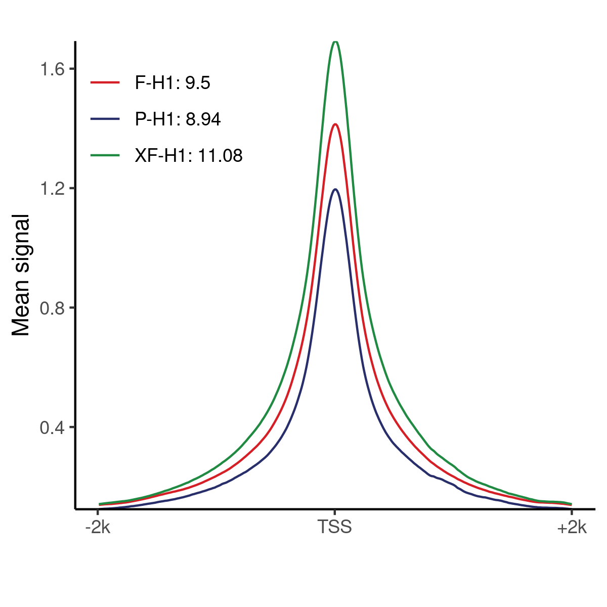{width="50%"}

-   Insert fragment length distribution

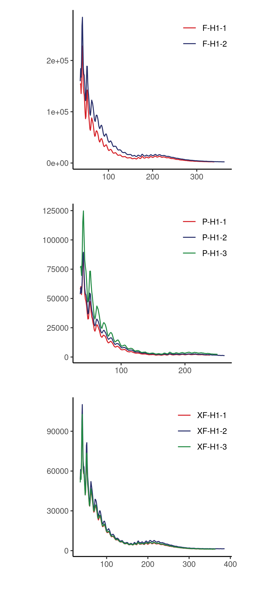{width="50%"}

### 2. Loading count data

Then we could load the data and get a peak matrix following the [`DiffBind`](https://bioconductor.org/packages/release/bioc/vignettes/DiffBind/inst/doc/DiffBind.pdf) pipeline.

Complete codes of this part can be find [here](https://github.com/sajuukLyu/Protocols-4pub/blob/main/b_DownstreamAnalysisScript/bulkATACana_2_loadCount.R).

```{r, eval = FALSE}
# grammar
library(tidyverse)
library(magrittr)
library(glue)
library(data.table)

# analysis
library(DiffBind)
```

In this process, we need to load the `.bam` files after the filter and consensus peaks of each sample got in preprocess pipeline. These files are very large, so they are not included here.

```{r, eval = FALSE}
bamFile <- list.files("bam", ".bam$", full.names = T)
usedSample <- str_remove_all(bamFile, ".*bam/|.filter.*")
sampleType <- str_remove(usedSample, "-[123]$")
sampleRep <- str_extract(usedSample, "[123]$") %>% as.numeric()

sampleSheet <- data.table(
  SampleID = usedSample,
  Condition = sampleType,
  Replicate = sampleRep,
  bamReads = bamFile,
  Peaks = str_c("peak/", sampleType, ".narrowPeak"),
  PeakCaller = "narrow"
)

dbaAll <- dba(sampleSheet = sampleSheet, minOverlap = 2)

dbaAll$chrmap %<>% str_c("chr", .)
dbaAll <- dba.blacklist(dbaAll, blacklist = DBA_BLACKLIST_HG19, greylist = F)
dbaAll$chrmap %<>% str_remove("chr")

dbaAll <- dba.count(dbaAll, minOverlap = 2, fragmentSize = 200, summits = 250)
dbaAll <- dba.normalize(dbaAll, background = T, normalize = DBA_NORM_NATIVE)
dbaAll <- dba.contrast(dbaAll, minMembers = 2, categories = DBA_CONDITION)
dbaAll <- dba.analyze(dbaAll, bBlacklist = F, bGreylist = F)

saveRDS(dbaAll, "dbaAll.rds")

diffList <- list()
diffList$F_vs_P <- dba.report(dbaAll, contrast = 1)
diffList$F_vs_XF <- dba.report(dbaAll, contrast = 2)
diffList$XF_vs_P <- dba.report(dbaAll, contrast = 3)

saveRDS(diffList, "diffList.rds")

peakMeta <- as.data.table(dbaAll$peaks[[1]][, 1:3])

saveRDS(peakMeta, "peakMeta.rds")

peakMtx <- map(dbaAll$peaks, ~ {.x$Score}) %>% reduce(cbind) %>% set_colnames(dbaAll$samples$SampleID) %>% as.data.table()

saveRDS(peakMtx, "peakMtx.rds")
```

After this process, we have done theree things:

1. Peaks of each sample are merged together and expanded to the same length (501 bp). The positions of every peak regions are saved to `peakMeta.rds`.

2. The normalized accessibility scores of each peak in each sample are calculated based on the number of reads overlapping peak regions. The peak matrix is saved to `peakMtx.rds`.

3. The differentially accessible peaks (DAP) between group of samples are calculated using `DESeq2` model. The results are saved to `diffList.rds`. 

Using these data, we can do some visualization work.

### 3. Ploting samples and DAPs

We can perform PCA and visualize the results.

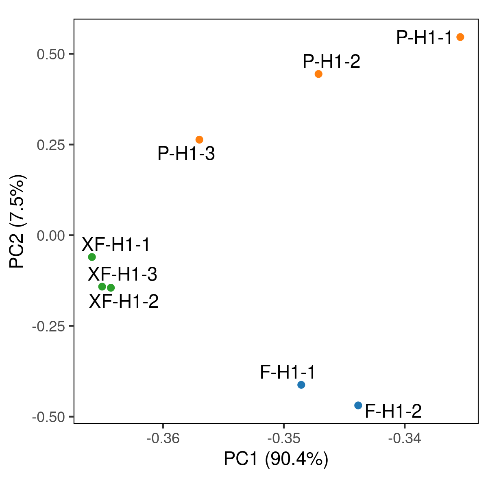{width="50%"}

Detailed codes for this plot can be find [here](https://github.com/sajuukLyu/Protocols-4pub/blob/main/c_VisualizationScript/Visulz_bulkATAC_PCA.R).

The DAPs among groups of samples can be clustered to some peak groups.

{width="50%"}

Detailed codes for this plot can be find [here](https://github.com/sajuukLyu/Protocols-4pub/blob/main/c_VisualizationScript/Visulz_bulkATAC_heatmapPeak.R).

Further, we could select the group 1 and group 4 of these peak sets and visualize in a more detail way, to show the 'real' accessibility signal of the peak regions of each sample.
This can be done in a similar way as TSS enrichment calculation process above.

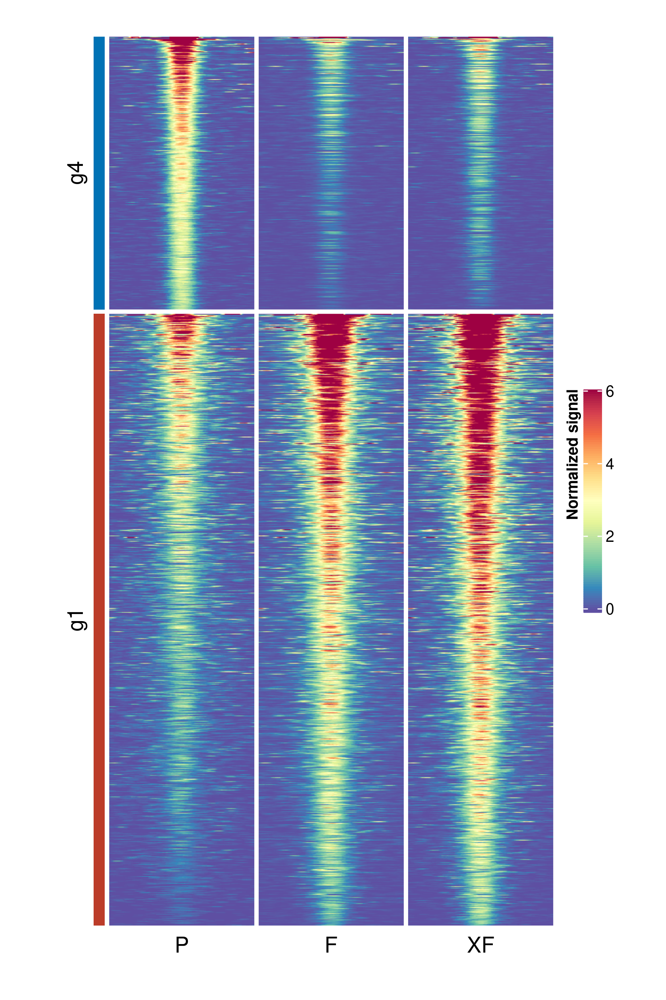{width="50%"}

Detailed codes for this plot can be find [here](https://github.com/sajuukLyu/Protocols-4pub/blob/main/c_VisualizationScript/Visulz_bulkATAC_heatmapTrack.R).

Sometimes it is also necessary to show some track plots, for example:

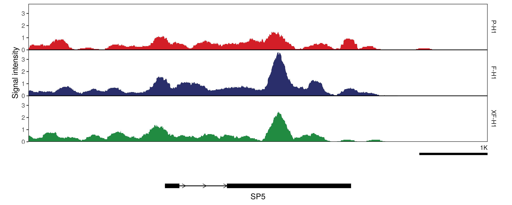{width="80%"}

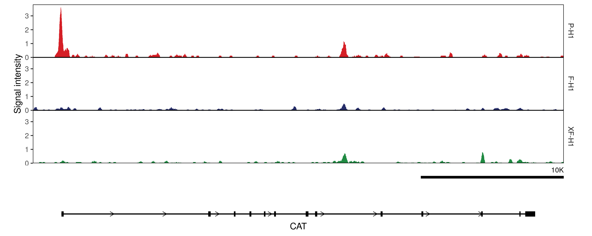{width="80%"}

Detailed codes for this plot type can be find [here](https://github.com/sajuukLyu/Protocols-4pub/blob/main/c_VisualizationScript/Visulz_bulkATAC_trackPlot.R).

### 4. Annotating peaks

There are some ways to annotate a peak to a nearby gene, here we use a simple way using `ChIPseeker`.

Complete codes of this part can be find [here](https://github.com/sajuukLyu/Protocols-4pub/blob/main/b_DownstreamAnalysisScript/bulkATACana_3_annotatePeak.R).

```{r, eval = FALSE}
library(ChIPseeker)
library(GenomicFeatures)
```

The reference genome and peak group data from heatmap visualization process is needed.

```{r, eval = FALSE}
txdb <- makeTxDbFromGFF("../../data/hg19genes.gtf")

peakMeta <- readRDS("peakMeta.rds")
peakMeta[, id := paste(Chr, Start, End, sep = "_")][]

peakGroup <- readRDS("peakGroup.rds")
peakIndex <- map(peakGroup, ~ {match(.x, peakMeta$id)})
```

The annotation of peaks are saved to `peakAnnoList.rds`.

```{r, eval = FALSE}
homerPeak <- peakMeta
homerPeak[, Chr := str_c("chr", Chr)][]

fwrite(homerPeak, "allPeak.homer", sep = "\t", col.names = F)

peakGRlist <- map(peakIndex, ~ {
  GRanges(
    seqnames = peakMeta[.x, Chr],
    ranges = IRanges(
      start = peakMeta[.x, Start],
      end = peakMeta[.x, End]))})

peakAnnoList <- map(peakGRlist, annotatePeak, TxDb = txdb, tssRegion = c(-2000, 2000))

map(peakGRlist, ~ {as.data.table(.x)[, c("width", "strand") := NULL][, id := 1:.N][, seqnames := str_c("chr", seqnames)]}) %>%
  iwalk(~ fwrite(.x, str_c("peakGroup_", .y, ".bed"), sep = "\t", col.names = F))

saveRDS(peakAnnoList, "peakAnnoList.rds")
```

We can plot a histogram to show the region of genome of each group of peak.

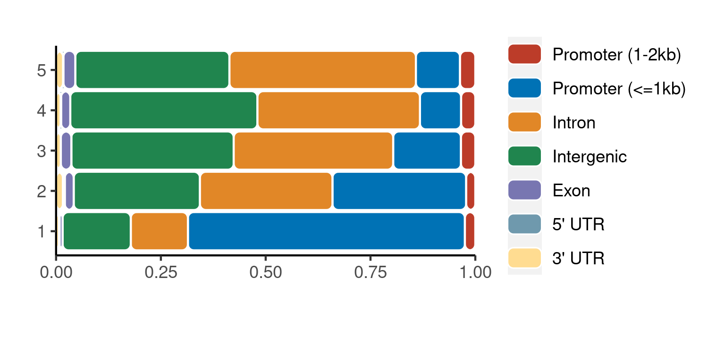{width="50%"}

Detailed codes for this plot can be find [here](https://github.com/sajuukLyu/Protocols-4pub/blob/main/c_VisualizationScript/Visulz_bulkATAC_peakAnnoDisp.R).

### 5. Performing GO analysis

We can perform GO analysis to the genes which annotated to TSS region of each peak group.

Complete codes of this part can be find [here](https://github.com/sajuukLyu/Protocols-4pub/blob/main/b_DownstreamAnalysisScript/bulkATACana_4_GO.R).

```{r, eval = FALSE}
library(org.Hs.eg.db)
library(clusterProfiler)
```

```{r, eval = FALSE}
anno <- readRDS("../../data/hg19anno.rds")
peakAnnoList <- readRDS("peakAnnoList.rds")

id2gene <- structure(anno$gene_name, names = anno$Geneid)

annoGene <- map(peakAnnoList, ~ {.x@anno$geneId})

egoList <- map(annoGene, ~ {
  enrichGO(
    gene = na.omit(select(org.Hs.eg.db, keys = .x, columns = "ENTREZID", keytype = "ENSEMBL")$ENTREZID),
    OrgDb = "org.Hs.eg.db", ont = "BP", pvalueCutoff = 1, qvalueCutoff = 1, readable = T)
})
names(egoList)

iwalk(egoList, ~ write.csv(.x@result, str_c("peakGroup_", .y, ".GO.csv")))
```

### 6. Motif enrichment and footprint annotation

How the groups of peaks are regulated by TF? We can perform motif enrichment analysis and annotate each peak with motifs possibly binding to it using `Homer`.

Complete codes of this part can be find [here](https://github.com/sajuukLyu/Protocols-4pub/blob/main/b_DownstreamAnalysisScript/bulkATACana_5_peakTF.R).

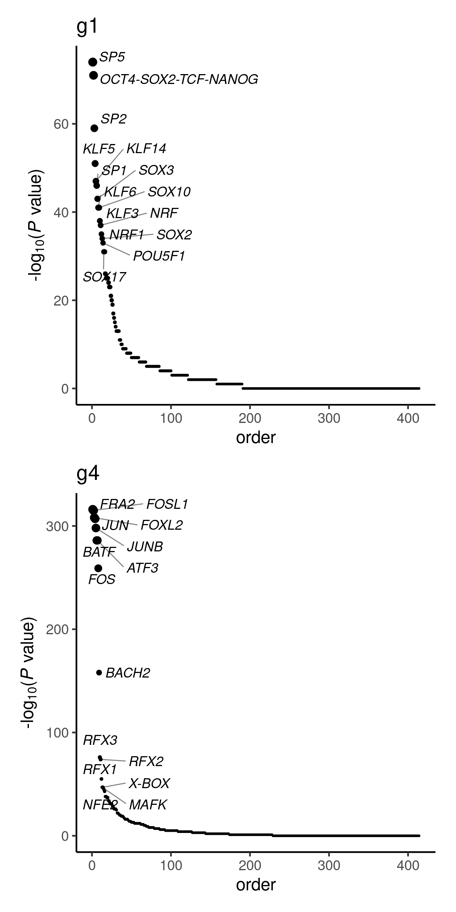{width="50%"}

Detailed codes for this plot can be find [here](https://github.com/sajuukLyu/Protocols-4pub/blob/main/c_VisualizationScript/Visulz_bulkATAC_motifEnrich.R).

We can see some of the motifs are highly enriched in different peak groups.

The annotation file containing peak-motif matrix `allPeak.txt` here is not included because it is too big.
Some of its columns are peak to gene annotation message, so we keep it as a independent file `peakAnnoHomer.rds`. However, only three columns of this file is needed for later analysis.

Here, we connect peaks around a gene region to that gene while leaving the peaks at intergenic regions connect to no gene.

The motif annotation data `motifAnno` contain the relationship between motif names and relative TFs.

```{r, eval = FALSE}
peakAnno <- fread("motif/allPeak.txt")
colnames(peakAnno)[1] %<>% str_remove(" .*")

saveRDS(peakAnno[, PeakID:`GC%`], "peakAnnoHomer.rds")
peakGene <- readRDS("peakAnnoHomer.rds")
peakGene <- peakGene[, c("PeakID", "Annotation", "Gene Name")]
colnames(peakGene)[3] <- "gene"
peakGene[, Annotation := str_remove(Annotation, " \\(.*")][]
peakGene[Annotation == "Intergenic", gene := "no"][]
setkey(peakGene, PeakID)

motifAnno <- readRDS("motifAnno.rds")

name2symbol <- structure(
  motifAnno$symbol,
  names = motifAnno$`Motif Name`
)

peakGroup <- readRDS("peakGroup.rds")
```

Here, only the motif-peak relationships with odd ratio high enough are kept.
The TF-motif relationship, motif-peak relationship, and peak-gene relationship are combined to get the TF-gene regulation network.
The weights of edges of this network are defined as the sum of the scores if a TF have multiple TF-motif-peak-gene path.

```{r, eval = FALSE}
selCols <- peakAnno[, Chr:`GC%`] %>% colnames()
peakAnno[, (selCols) := NULL]

motifMeta <- name2symbol[str_remove(colnames(peakAnno)[2:ncol(peakAnno)], " .*")]

motifMeta <- data.table(
  name = names(motifMeta),
  symbol = motifMeta
)

motifMeta[, rep := 1:.N, by = symbol][]
motifMeta[rep != 1, symbol := str_c(symbol, "_", rep)][]
colnames(peakAnno)[2:ncol(peakAnno)] <- motifMeta$symbol

peakTFmtx <- melt(peakAnno, id.vars = "PeakID", variable.name = "TF", value.name = "val")
peakTFbind <- peakTFmtx[val > -log(1e-4)]
peakTFbind[, .N, by = PeakID]$N %>% table()
peakTFbind[, .N, by = PeakID]$N %>% hist(breaks = 50)
setkey(peakTFbind, PeakID)

peakGroup[c("1", "4")] %>% imap(~ {
  n_TFpeak <- peakTFbind[.x][, gene := peakGene[PeakID, gene]][!is.na(val)]
  n_TFgene <- n_TFpeak[!gene %in% c("no", ""), .(val = sum(val)), by = .(TF, gene)] %>% set_colnames(c("Source", "Target", "Weight"))
  n_TFgene[, Weight := rescale(Weight, to = c(0.05, 1))]
  n_node <- table(c(as.vector(n_TFgene$Source), n_TFgene$Target)) %>% as.data.table() %>% set_colnames(c("Id", "Weight"))
  n_node[, `:=` (Label = Id, type = ifelse(Id %in% n_TFgene$Source, "tf", "gene"))]
  
  fwrite(n_TFgene, str_c("network/", .y, "_TFgene.csv"), sep = ",")
  fwrite(n_node, str_c("network/", .y, "_node.csv"), sep = ",")
})
```

The output graph node file `n_node.csv` and graph edge file `n_TFgene.csv` can directly load to graph visualization software [`gephi`](https://gephi.org).
Using `Force Atlas 2` arithmetic, we can put each node at a proper position, then the data can export to a `.gexf` file then load to R.

After some transformation, the graph can be visualized, showing important TFs regulationg the most number of genes through each peak group.

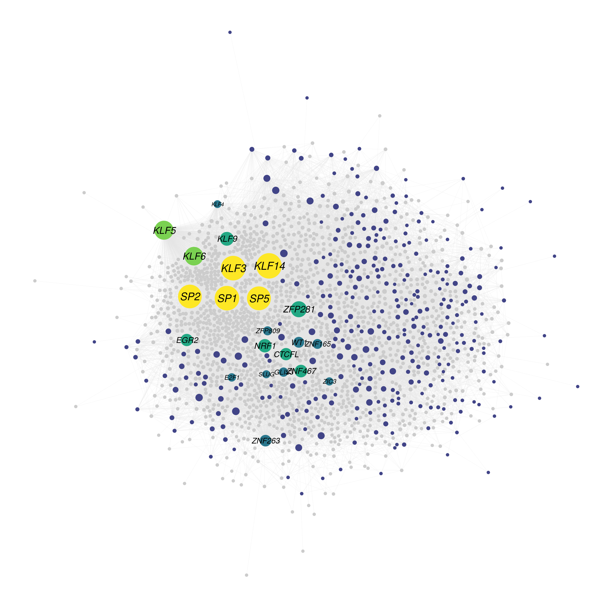{width="80%"}

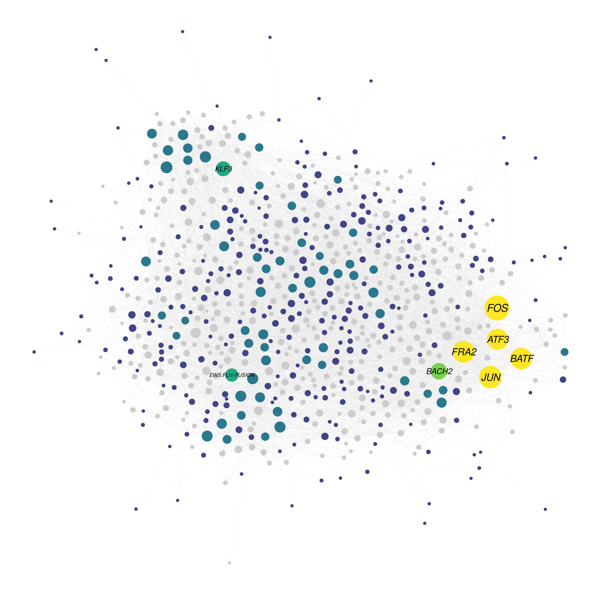{width="80%"}

Detailed codes for this plot type can be find [here](https://github.com/sajuukLyu/Protocols-4pub/blob/main/c_VisualizationScript/Visulz_bulkATAC_network.R).

Other content will be added soon.

```{r}
sessionInfo()
```

