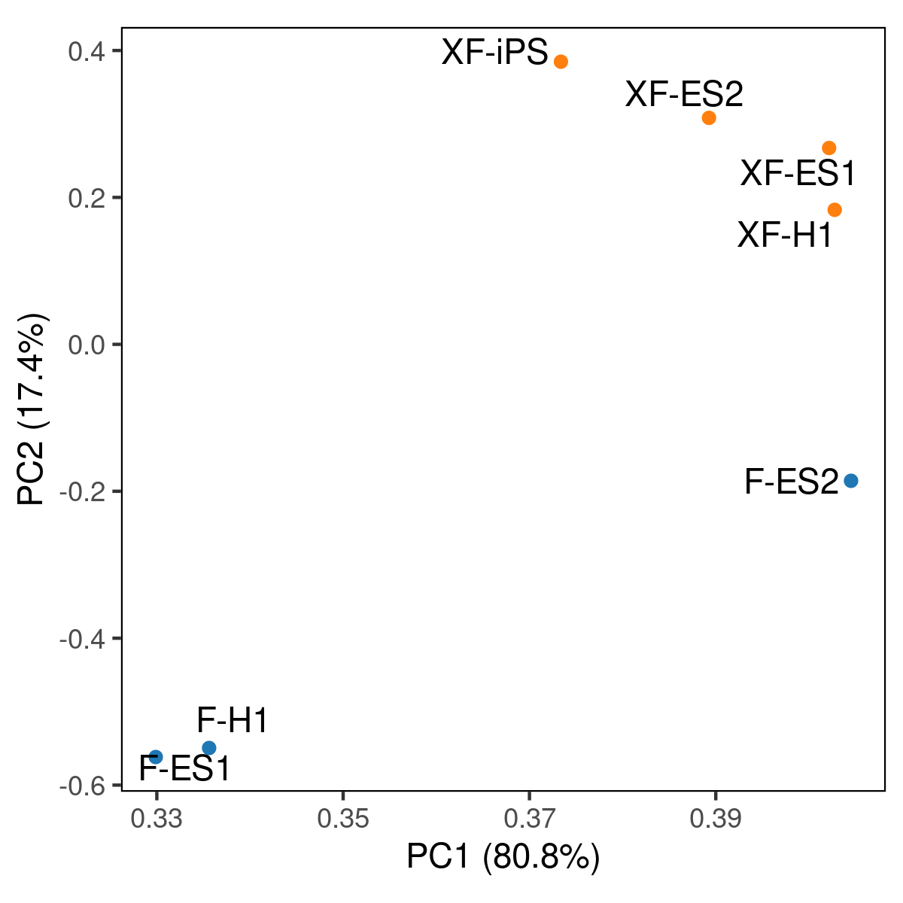
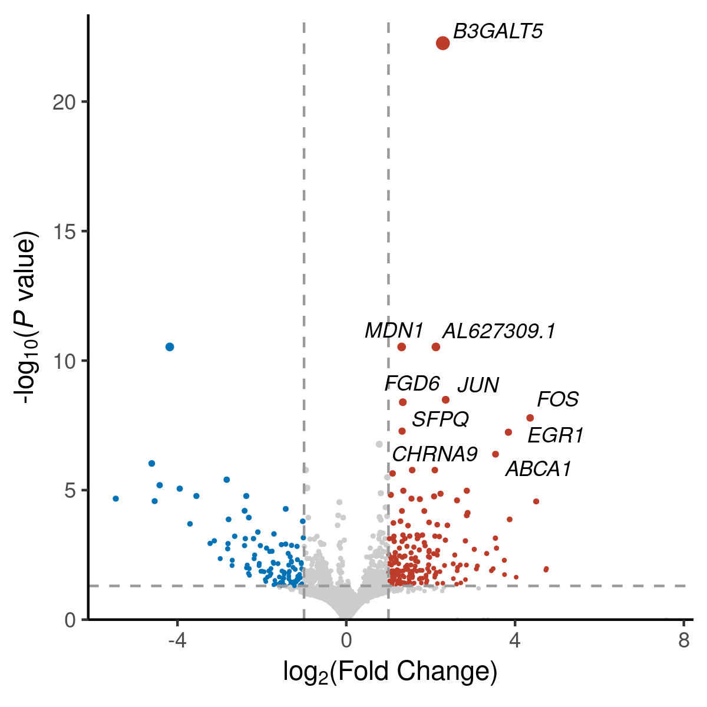
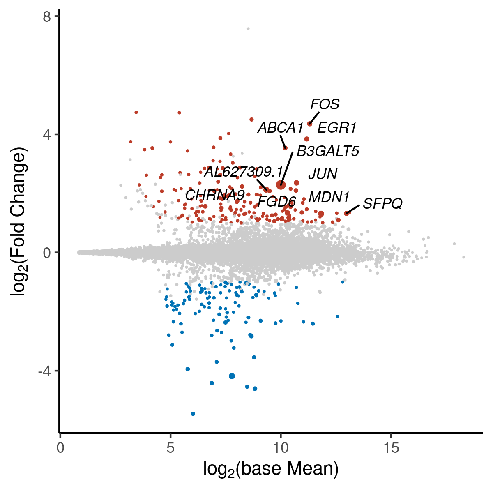
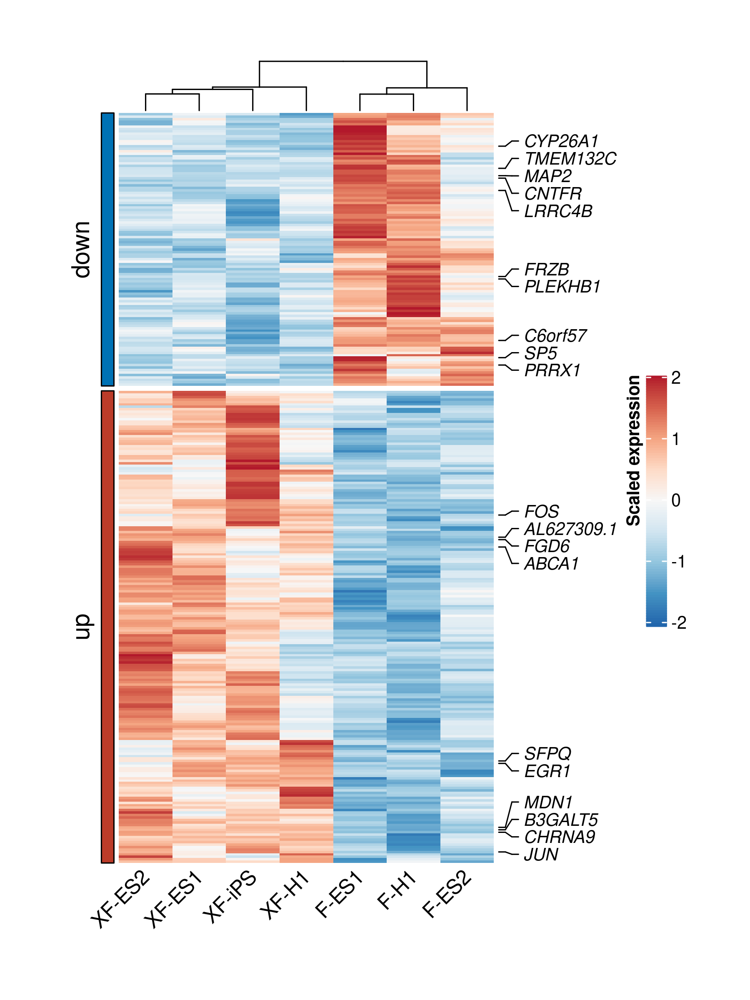
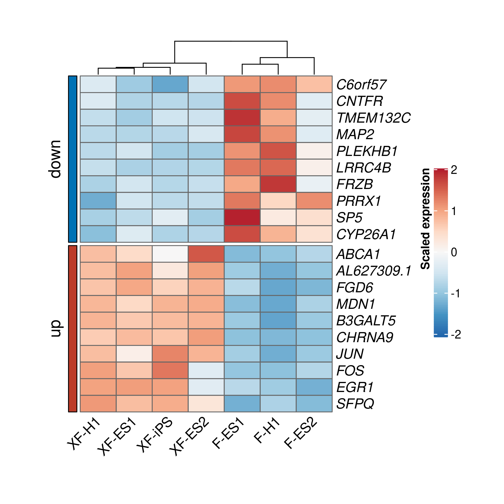
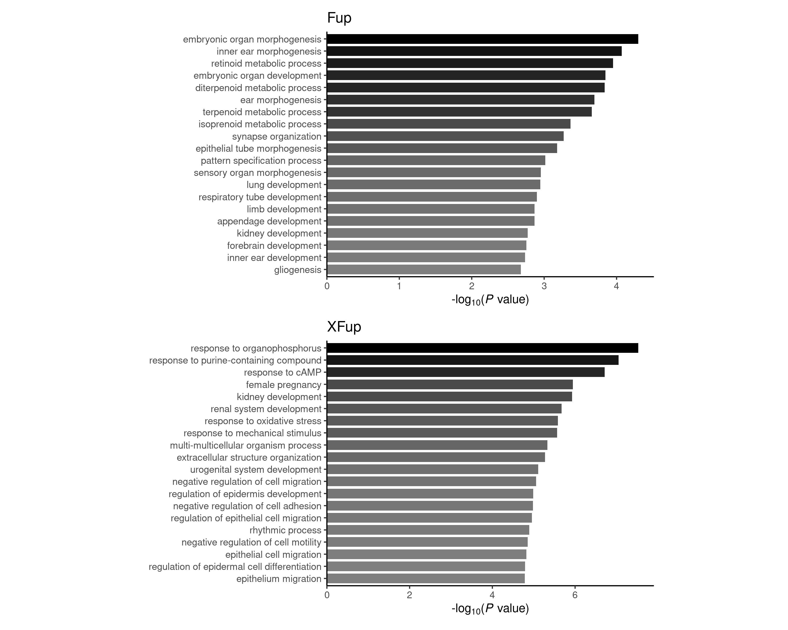

```{r setup, include = FALSE}
knitr::opts_chunk$set(
  collapse = F,
  comment = "## "
)
```

```{css, echo = FALSE}
pre {
  max-height: 300px;
  overflow-y: auto;
  background-color: AliceBlue;
}

pre[class] {
  max-height: 200px;
}
```

## Preprocess

Detailed source code is located here [`bulkRNApre.R`](https://github.com/sajuukLyu/Protocols-4pub/blob/main/a_PreprocessPipeline/bulkRNApre.R) with a [vignette](https://sajuuklyu.github.io/Protocols-4pub/exampleData/RNA/bulkRNApre.html) explaining each step. The flow chart of preprocess pipeline of bulk RNA-seq shows in the bottom.

{width="50%"}

### Software preparation

-   [FastQC](https://www.bioinformatics.babraham.ac.uk/projects/fastqc)

-   [multiQC](https://multiqc.info)

-   [Trimmomatic](http://www.usadellab.org/cms/?page=trimmomatic)

-   [STAR](https://github.com/alexdobin/STAR)

-   [RSeQC](http://rseqc.sourceforge.net)

-   [featureCounts](http://bioinf.wehi.edu.au/featureCounts/)

By default, the path to these installed software should be added to `$PATH` in order to use them directly. Or we can install them in a virtual environment like `conda`. Specifically, we can use the full path to the software in commands if necessary.

### 0. Dictionary design

After all the preprocess, the dictionary structure will look like this:

```{bash, eval = FALSE}
0_fastq  1_qc  2_trim  3_qc  4_map  5_infer  6_count  code  raw
```

The raw sub-dir contains the raw fastq files need (download from public databases, see [`downloadData.R`](https://github.com/sajuukLyu/Protocols-4pub/blob/main/b_DownstreamAnalysisScript/downloadData.R) for detail)

```{bash, eval = FALSE}
total 13G
drwxr-xr-x  2 lvyl lic 4.0K Mar 31 00:36 ./
drwxr-xr-x 12 lvyl lic 4.0K Mar 31 16:51 ../
-rw-r--r--  1 lvyl lic 925M Mar 30 23:17 SRR11459602.sra_1.fastq.gz
-rw-r--r--  1 lvyl lic 955M Mar 30 23:17 SRR11459602.sra_2.fastq.gz
-rw-r--r--  1 lvyl lic 927M Mar 30 23:24 SRR11459603.sra_1.fastq.gz
-rw-r--r--  1 lvyl lic 947M Mar 30 23:24 SRR11459603.sra_2.fastq.gz
-rw-r--r--  1 lvyl lic 899M Mar 30 23:32 SRR11459604.sra_1.fastq.gz
-rw-r--r--  1 lvyl lic 954M Mar 30 23:32 SRR11459604.sra_2.fastq.gz
-rw-r--r--  1 lvyl lic 894M Mar 30 23:39 SRR11459605.sra_1.fastq.gz
-rw-r--r--  1 lvyl lic 894M Mar 30 23:39 SRR11459605.sra_2.fastq.gz
-rw-r--r--  1 lvyl lic 891M Mar 30 23:55 SRR11459606.sra_1.fastq.gz
-rw-r--r--  1 lvyl lic 907M Mar 30 23:55 SRR11459606.sra_2.fastq.gz
-rw-r--r--  1 lvyl lic 832M Mar 31 00:07 SRR11459607.sra_1.fastq.gz
-rw-r--r--  1 lvyl lic 840M Mar 31 00:07 SRR11459607.sra_2.fastq.gz
-rw-r--r--  1 lvyl lic 853M Mar 31 00:20 SRR11459608.sra_1.fastq.gz
-rw-r--r--  1 lvyl lic 868M Mar 31 00:20 SRR11459608.sra_2.fastq.gz
```

There are some special designing in the pipeline.

-   We use symbol links to rename raw files. There are two major advantages: 1. clarify the original file of renamed files. 2. save disk space, deleting raw files will release the used space. Hard links could not do these.

```{bash, eval = FALSE}
total 8.0K
drwxr-xr-x  2 lvyl lic 4.0K Mar 31 01:04 ./
drwxr-xr-x 12 lvyl lic 4.0K Mar 31 16:51 ../
lrwxrwxrwx  1 lvyl lic   33 Mar 31 00:59 F-ES1_1.fq.gz -> ../raw/SRR11459602.sra_1.fastq.gz
lrwxrwxrwx  1 lvyl lic   33 Mar 31 00:59 F-ES1_2.fq.gz -> ../raw/SRR11459602.sra_2.fastq.gz
lrwxrwxrwx  1 lvyl lic   33 Mar 31 00:59 F-ES2_1.fq.gz -> ../raw/SRR11459603.sra_1.fastq.gz
lrwxrwxrwx  1 lvyl lic   33 Mar 31 00:59 F-ES2_2.fq.gz -> ../raw/SRR11459603.sra_2.fastq.gz
lrwxrwxrwx  1 lvyl lic   33 Mar 31 00:59 F-H1_1.fq.gz -> ../raw/SRR11459604.sra_1.fastq.gz
lrwxrwxrwx  1 lvyl lic   33 Mar 31 00:59 F-H1_2.fq.gz -> ../raw/SRR11459604.sra_2.fastq.gz
lrwxrwxrwx  1 lvyl lic   33 Mar 31 00:59 XF-ES1_1.fq.gz -> ../raw/SRR11459605.sra_1.fastq.gz
lrwxrwxrwx  1 lvyl lic   33 Mar 31 00:59 XF-ES1_2.fq.gz -> ../raw/SRR11459605.sra_2.fastq.gz
lrwxrwxrwx  1 lvyl lic   33 Mar 31 00:59 XF-ES2_1.fq.gz -> ../raw/SRR11459606.sra_1.fastq.gz
lrwxrwxrwx  1 lvyl lic   33 Mar 31 00:59 XF-ES2_2.fq.gz -> ../raw/SRR11459606.sra_2.fastq.gz
lrwxrwxrwx  1 lvyl lic   33 Mar 31 00:59 XF-H1_1.fq.gz -> ../raw/SRR11459607.sra_1.fastq.gz
lrwxrwxrwx  1 lvyl lic   33 Mar 31 00:59 XF-H1_2.fq.gz -> ../raw/SRR11459607.sra_2.fastq.gz
lrwxrwxrwx  1 lvyl lic   33 Mar 31 00:59 XF-iPS_1.fq.gz -> ../raw/SRR11459608.sra_1.fastq.gz
lrwxrwxrwx  1 lvyl lic   33 Mar 31 00:59 XF-iPS_2.fq.gz -> ../raw/SRR11459608.sra_2.fastq.gz
```

-   We split the multiple commands into batched scripts in some time consuming steps. For example, if we have 100 mapping tasks, we could split these tasks to 10 batched scripts with 10 commands one by one in each script. In this way, we can run these commands 'parallelly'. If each script uses 20 cores, we will use total 10 \* 20 = 200 cores at the same time in a local server. However, we can submit these tasks to a computing cluster with the 10 scripts running on 10 different nodes. A special function is designed to fulfill this demand.

```{bash, eval = FALSE}
code/
├── 1_qc.sh
├── 2_trim
│   ├── batch0.sh
│   ├── batch1.sh
│   ├── batch2.sh
│   ├── batch3.sh
│   ├── batch4.sh
│   ├── batch5.sh
│   ├── batch6.sh
│   └── submit.sh
├── 3_qc.sh
├── 4_map
│   ├── batch0.sh
│   ├── batch1.sh
│   ├── batch2.sh
│   ├── batch3.sh
│   ├── batch4.sh
│   ├── batch5.sh
│   ├── batch6.sh
│   └── submit.sh
├── 5_infer.sh
└── 6_count.sh
```

### 1. Quality Control

The quality control is performed using FastQC. Then multiple QC reports can be integrated to one report using multiQC.

{width="50%"}

### 2. Trimming adapters

After removing the Illumina universal adapter `TruSeq3-PE-2.fa` using Trimmomatic, we can get clean reads with no adapter left.

{width="50%"}

{width="50%"}

### 3. Mapping reads to reference genome

The mapping is performed using STAR.

{width="50%"}

### 4. Counting reads of each feature

Before counting, we need to clearify whether sequencing are strand-specific. This inferance is performed using RSeQC.
The result will be noisy if we set wrong parameters to count strand-specific sequencing reads.

{width="50%"}

After counting, the file `counts.txt` will be used to perform downstream analysis.

## Downstream analysis

### 1. Loading count data

Complete codes of this part can be find [here](https://github.com/sajuukLyu/Protocols-4pub/blob/main/b_DownstreamAnalysisScript/bulkATACana_2_loadCount.R).

First, some packages are loaded in convenient.

```{r, message = FALSE, warning = FALSE}
library(tidyverse)
library(magrittr)
```

All the raw count files are located in specified dir. Here we only have one.

```{r}
dataPath <- "data"
(usedData <- list.files(dataPath, "txt", full = T))
```

Next reading all the count files while removing their fist 7 columns of gene annotation data.

```{r, cache = TRUE}
dataMtx <- map(usedData, ~ read_delim(.x, delim = "\t", comment = "#")) %>%
  map(~ .x[-1:-7]) %>%
  purrr::reduce(cbind) %>%
  as.matrix()
head(dataMtx)
```

These gene annotation data are also useful, so we can seperate and save them to load when in need.

```{r, cache = TRUE}
anno <- readRDS("../../data/hg19anno.rds")
head(anno)
```

We can give `dataMtx` meaningful row names as gene names and column names as sample name.

```{r}
rownames(dataMtx) <- scater::uniquifyFeatureNames(anno$Geneid, anno$gene_name)
colnames(dataMtx) %<>% str_replace_all(".*map/|Aligned.*", "")
head(dataMtx)
```

Then the count matrix should be saved for later use.

```{r, eval = FALSE}
saveRDS(dataMtx, "dataMtx.rds")
```

### 2. Differentially expressed gene analysis {.tabset}

#### Using DESeq2

For samples with duplicates, we can use DESeq2 to perform DEG analysis.

Complete codes of this part can be find [here](https://github.com/sajuukLyu/Protocols-4pub/blob/main/b_DownstreamAnalysisScript/bulkRNAana_2b_DEseq2.R).

```{r, message = FALSE, warning = FALSE}
library(glue)
library(DESeq2)
```

We can select part of samples to analyze. Here we keep all.

```{r}
colnames(dataMtx)
usedMtx <- dataMtx[, 1:7]
```

A `SummarizedExperiment` object should be created using count data.
We can set condition factors to tell DESeq2 how these samples are grouped.
Then we can create a `DESeqDataSet` using these data.

```{r}
# dir.create("DESeq2")

se <- SummarizedExperiment(assays = list(counts = as.matrix(usedMtx)))
se$condition <- factor(
  rep(c("F", "XF"), c(3, 4)),
  levels = c("F", "XF")
)

dds <- DESeqDataSet(se, design = ~ condition)
dds
```

Lowly expressed genes among samples will be filtered.

```{r}
rs <- rowMeans(usedMtx)
geneKeep <- rs > quantile(rs, 0.4)
sum(geneKeep)
dds <- dds[geneKeep, ]
```

The variance stabilizing transformated matrix will be used for visualization later.

```{r, eval = FALSE}
vsd <- vst(dds, blind = T)
saveRDS(vsd, "DESeq2/vsd.rds")
```

DEG analysis will be performed between groups of samples.

```{r}
dds <- DESeq(dds)

resultsNames(dds)
```

The results of DEG can be exported as Excel readable .csv files.

```{r, eval = FALSE}
DEGres <- list()
DEGres$XF_vs_F <- lfcShrink(dds, coef = "condition_XF_vs_F", type = "apeglm")

iwalk(DEGres, ~ write.csv(.x, glue("DESeq2/{.y}.DEG.csv")))

saveRDS(dds, "DESeq2/dds.rds")
```

#### Using DESeq

For samples with no replicates, we can use DESeq to get a 'p value' for each gene between one sample and another. It is not very useful for well designed experiments.
However, we can still use it for visulization.

Complete codes of this part can be find [here](https://github.com/sajuukLyu/Protocols-4pub/blob/main/b_DownstreamAnalysisScript/bulkRNAana_2a_DESeq.R).

```{r, eval = FALSE}
library(DESeq)

dataMtx <- readRDS("dataMtx.rds")

colnames(dataMtx)
usedMtx <- dataMtx[c(
  c("wanted sample names"),
  NULL
)]
```

After loading data and selecting wanted samples, we can create a `CountDataSet` object with count data matrix and condition factor.
Note that we should set the parameters `method = "blind"` and `sharingMode = "fit-only"` here if we have no replicates.

```{r, eval = FALSE}
dir.create("DESeq")

condition <- factor(
  c("a", "b", "c"),
  levels = c("a", "b", "c")
)

cds <- newCountDataSet(usedMtx, condition) %>%
  estimateSizeFactors() %>%
  estimateDispersions(method = "blind", sharingMode = "fit-only")
```

The variance stabilizing transformated matrix will be used for visualization later.

```{r, eval = FALSE}
vsd <- varianceStabilizingTransformation(cds)
saveRDS(vsd, "DESeq/vsd.rds")
```

Perform DEG test using `nbinomTest` if there is no other choice.

```{r, eval = FALSE}
# DEGres <- list()
# DEGres$a_vs_b <- nbinomTest(cds, "a", "b")
# DEGres$a_vs_c <- nbinomTest(cds, "a", "c")

# iwalk(DEGres, ~ write_csv(.x, glue("DESeq/{.y}.DEG.csv")))
```

### {-}

### 3. Plot samples and DEGs

We can perform PCA and visualize the results.

{width="50%"}

Detailed codes for this plot can be find [here](https://github.com/sajuukLyu/Protocols-4pub/blob/main/c_VisualizationScript/Visulz_bulkATAC_PCA.R).

For DEGs, there are some ways to visualize the difference between group of samples.

-   volcano plot

{width="50%"}

Detailed codes for this plot can be find [here](https://github.com/sajuukLyu/Protocols-4pub/blob/main/c_VisualizationScript/Visulz_bulkRNA_volcano.R).

-   MA plot

{width="50%"}

Detailed codes for this plot can be find [here](https://github.com/sajuukLyu/Protocols-4pub/blob/main/c_VisualizationScript/Visulz_bulkRNA_MAplot.R).

Heatmap is a good way to describe the comprehensive expression pattern of used samples.
We can plot heatmaps with a large amount of genes with some interested ones labeled on the side.

{width="50%"}

Or we can just plot heatmaps with selected interesting genes.

{width="50%"}

Detailed codes for this two plots can be find [here](https://github.com/sajuukLyu/Protocols-4pub/blob/main/c_VisualizationScript/Visulz_bulkRNA_heatmap.R).

### 4. Performing GO analysis

To understand the biology function of differentially expressed genes, GO analysis will be performed using `clusterProfiler`.

```{r, warning = FALSE, message = FALSE}
library(data.table)
library(org.Hs.eg.db)
library(clusterProfiler)
```

DEGs will be loaded as `data.table` with `NA`s of adjusted p value are set to 1.

```{r}
diffData <- fread("DESeq2/XF_vs_F.DEG.csv")
colnames(diffData)[1] <- "gene"

diffData[is.na(padj), padj := 1][]
```

The genes with fold change > 2 or < -2 with significant difference are defined as up- or down-regulated, respectively.

```{r}
diffData[, type := "ns"]
diffData[log2FoldChange > 1 & padj < 0.05, type := "up"][log2FoldChange < -1 & padj < 0.05, type := "down"][]
```

These gene sets are converted to `Entrez ID` and perform GO enrichment test.

```{r, eval = FALSE}
geneList <- list()
geneList$XFup <- diffData[type == "up", gene]
geneList$Fup <- diffData[type == "down", gene]

egoList <- map(geneList, ~ {
  enrichGO(
    gene = na.omit(select(org.Hs.eg.db, keys = .x, columns = "ENTREZID", keytype = "SYMBOL")$ENTREZID),
    OrgDb = "org.Hs.eg.db", ont = "BP", pvalueCutoff = 1, qvalueCutoff = 1, readable = T)
})

iwalk(egoList, ~ write.csv(.x@result, str_c(.y, ".GO.csv")))
```

The top enriched terms of each gene set can be visualized using histogram.

{width="50%"}

Detailed codes for this plot can be find [here](https://github.com/sajuukLyu/Protocols-4pub/blob/main/c_VisualizationScript/Visulz_bulkRNA_GO.R).

Other content will be added soon.

```{r}
sessionInfo()
```
